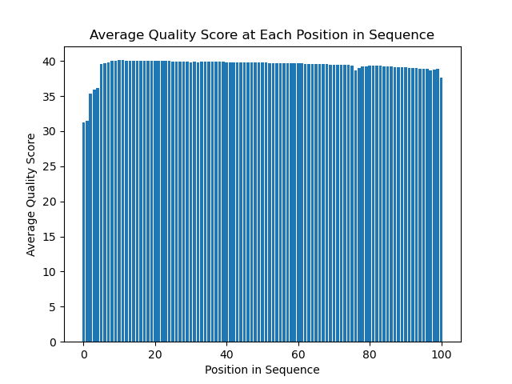
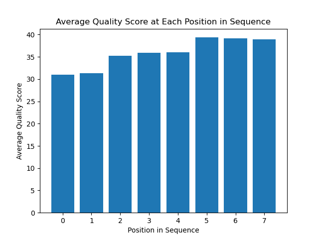
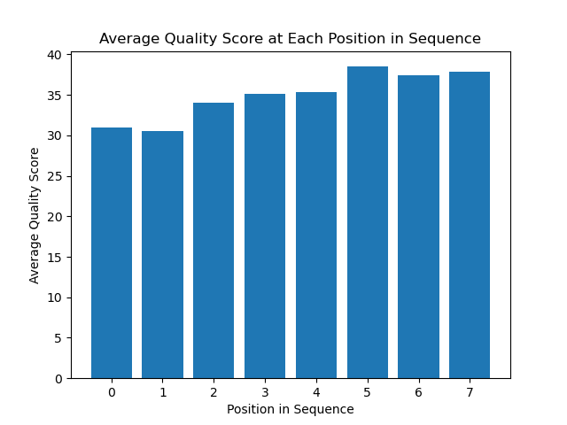
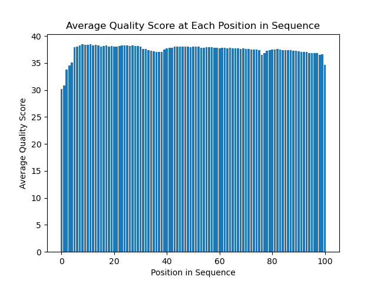

# Assignment the First

## Part 1
1. Be sure to upload your Python script.

| File name | label |
|---|---|
| 1294_S1_L008_R1_001.fastq.gz | Read 1 |
| 1294_S1_L008_R2_001.fastq.gz | Index 1 |
| 1294_S1_L008_R3_001.fastq.gz | Index 2 |
| 1294_S1_L008_R4_001.fastq.gz | Read 2 |

2. Per-base NT distribution
    1. 
    Read 1 histogram: 
    

    Read 2 histogram: 
    

    Read 3 histogram: 
    

    Read 4 histogram: 
    
    
    2. Because each read in the given fastq files is 101 bases long, it would likely be acceptable to use a quality score cutoff of 20, since this would mean that only ~1 basecall would be incorrect per 100, resulting in one incorrect base call per read. 
    3. The total number of indexes containing an N was 7304664, R2: 3976613, R3: 3328051 
    ```zcat 1294_S1_L008_R2_001.fastq.gz | sed -n "2~4p" | grep -c "N"```
    
## Part 2
1. The problem: some of the reads in R1 and R4 files are either low-quality or have swapped indices, meaning that their binning will be incorrect. In either case, we want to remove these cases while de-multiplexing, leaving us with high quality, correctly-indexed reads.
2. Informative output: we want to send each read (all of it) to the bin that corresponds to it's attached barcode. Additionally, we want to sort out the low-quality and index-hopped reads to bins corresponding to those categories. In addition to these output files, it might be helpful to have the number of reads that were deemed low-quality or index-hopped printed out per read file. 
3. Upload your [4 input FASTQ files](../TEST-input_FASTQ) and your [>=6 expected output FASTQ files](../TEST-output_FASTQ).
4. Pseudocode (see ```pseudo.txt```)
5. High level functions. (see ```./scripts_used/```) 
